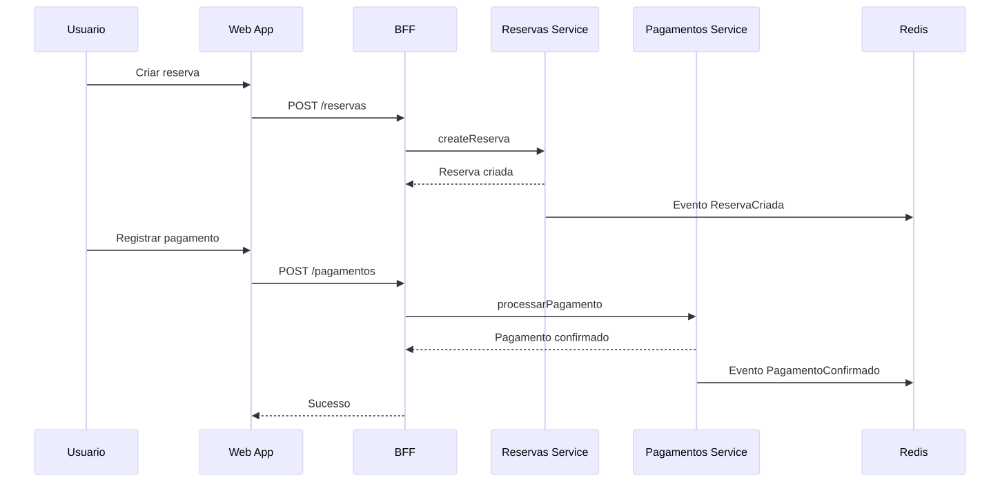
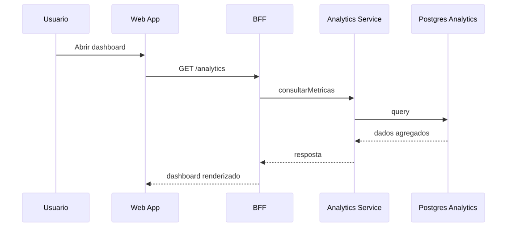

# MarcaHub
# Architecture Documentation

## 🧩 Business / System Context


---

## 🔄 Core Flows

### Reserva-Pagamento


### Analytics

---

## 🧠 Containers / Services


---

## 🚀 Deployment


---

## 🗃️ Data Model


```text
marca-platform/
│
├── docs/
│   ├── adr/
│   ├── diagrams/
│   │   ├── business-context/
│   │   ├── flows/
│   │   ├── use-cases/
│   │   ├── db/
│   │   └── infra/
│   └── api/
│
├── services/
│   ├── reservas/
│   │   ├── app/
│   │   ├── tests/
│   │   ├── Dockerfile
│   │   └── requirements.txt
│   │
│   ├── pagamentos/
│   ├── analytics/
│   
├── bff/
│   ├── src/
│   │   ├── main/
│   │   │   ├── java/
│   │   │   └── resources/
│   ├── Dockerfile
│   └── pom.xml
│
├── frontend/
│   ├── src/
│   │   ├── components/
│   │   ├── pages/
│   │   ├── services/          
│   │   └── App.js
│   ├── package.json
│   └── public/
│
├── infra/
│   ├── docker-compose.yml
│   └── README.md
│
├── .github/workflows/
│   ├── build.yml
│   └── deploy.yml
├── .gitignore
└── README.md

