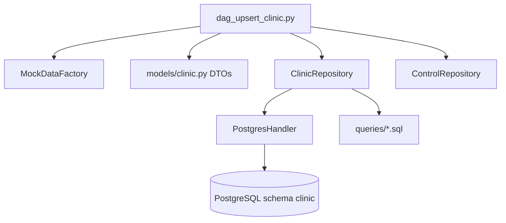
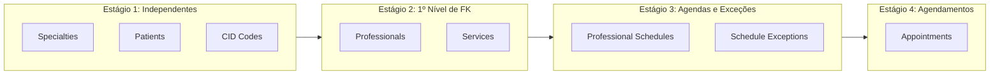

# Plano de Implementação: DAG de População de Clinic (P2)

## 1. Visão Geral e Arquitetura

O objetivo desta unidade de mudança é implementar o pipeline de dados do schema `clinic` no Apache Airflow (`dag_upsert_clinic.py`), permitindo a geração e persistência de dados sintéticos realistas e idempotentes para suportar testes, analytics e validação de regras de negócio.

O design segue a arquitetura em camadas e práticas DDD documentadas em `etl/airflow/docs/dag-development.md`:

---

## 2. Componentes e Decisões Técnicas

### 2.1 Orquestração Relacional (Topologia da DAG)
Como as 8 entidades possuem dependências de integridade referencial (Foreign Keys), a execução da DAG deve seguir uma ordem estrita em 4 estágios:

1. **Estágio 1 (Tabelas Base)**:
   - `specialties` (independente)
   - `patients` (independente)
   - `cid_codes` (independente)
2. **Estágio 2 (Dependem de Specialties)**:
   - `professionals` (usa `specialty_id`)
   - `services` (usa `specialty_id`)
3. **Estágio 3 (Dependem de Professionals)**:
   - `professional_schedules` (usa `professional_id`)
   - `schedule_exceptions` (usa `professional_id`)
4. **Estágio 4 (Dependem de todas as anteriores)**:
   - `appointments` (usa `patient_id`, `professional_id`, `service_id`, `cid_id`)

### 2.2 Resolução de Parâmetros e Idempotência SQL
- **Padronização de Sintaxe**: Todas as queries SQL em `clinic/queries/*.sql` adotam `:param_name` para compatibilidade estrita com o `PostgresHandler` e SQLAlchemy 2.0.
- **Garantia de Unicidade**: Para viabilizar cláusulas `ON CONFLICT` nativas do PostgreSQL:
  - Adição de migration Flyway `V20260505__add_clinic_unique_constraints.sql` com índices únicos para:
    - `clinic.services (specialty_id, service_name)`
    - `clinic.professional_schedules (professional_id, day_of_week)`
    - `clinic.schedule_exceptions (professional_id, start_datetime, end_datetime)`
    - `clinic.appointments (patient_id, professional_id, appointment_date, start_time)`

### 2.3 Repositório de Acesso a Dados (`ClinicRepository`)
- Localizado em `etl/airflow/dags/infraestructure/repository/clinic/clinic_repo.py`.
- Expõe métodos batch para cada entidade (`upsert_specialties`, `upsert_professionals`, etc.).
- Expõe métodos de consulta de IDs para alimentar geradores de chaves estrangeiras (`get_specialty_ids`, `get_professional_ids`, `get_patient_ids`, `get_cid_ids`, `get_services`).

### 2.4 Gerador de Mocks e Extensões
- Reutilização da `MockDataFactory` em `etl/airflow/dags/utils/mock_data_generator.py`.
- Mock especializado para horários, especialidades médicas reais (e.g. Odontologia, Cardiologia, Ortopedia, Dermatologia), procedimentos médicos/odontológicos, faixas de preços e status de agendamentos.

### 2.5 Rastreabilidade com Control Dataset
- Integração com `ControlRepository` registrando `start_pipeline`, `finalize_pipeline` (`SUCCESS` com contagem total de registros) e `handle_failure` (`FAILED` com mensagem de erro da task falha).

---

## 3. Alterações Estruturais e Arquivos Afetados

| Arquivo | Ação | Responsabilidade |
| :--- | :--- | :--- |
| `database/render/migrations/V20260505__add_clinic_unique_constraints.sql` | Criar | Adicionar índices/constraints únicos para suportar `ON CONFLICT`. |
| `etl/airflow/dags/infraestructure/database/postgres/postgres_handler.py` | Modificar | Adicionar método `fetch_all` para leitura relacional de IDs. |
| `etl/airflow/dags/infraestructure/repository/clinic/queries/*.sql` | Modificar | Corrigir sintaxe para `:param` e ajustar cláusulas `ON CONFLICT`. |
| `etl/airflow/dags/infraestructure/repository/clinic/clinic_repo.py` | Criar | Implementar `ClinicRepository` com métodos de upsert e consulta de FKs. |
| `etl/airflow/dags/dag_upsert_clinic.py` | Criar | Implementar a DAG principal do Airflow com tarefas encadeadas. |
| `etl/airflow/dags/tests/test_clinic_pipeline.py` | Criar | Validar funcionamento do repositório, DTOs e geração de dados. |

---

## 4. Estratégia de Testes e Validação

1. **Validação de DTOs e Models**:
   - Testar instanciação e serialização/desserialização dos 8 modelos Pydantic com `model_dump()`.
2. **Validação de Geração de Mock**:
   - Verificar coerência de tipos, documentos válidos (CPF, CRM) e faixas de datas/horários.
3. **Validação de Queries SQL e Idempotência**:
   - Validar sintaxe SQL das queries com `:param`.
   - Execução em lote garantindo que re-execuções não quebrem por duplicatas (`ON CONFLICT`).
4. **Validação de DAG Airflow**:
   - Validar importação da DAG no Airflow (`dagbag.process_file` / syntax check).

---

## 5. Riscos e Mitigações

* **Risco**: Chaves estrangeiras inexistentes ao gerar agendamentos.
  * **Mitigação**: DAG encadeia a execução garantindo que entidades pai persistam antes da geração de entidades filhas, recuperando os IDs reais gravados no banco.
* **Risco**: Consumo excessivo de memória em lotes grandes.
  * **Mitigação**: Processamento em lotes (`batch_size`) e uso de generators.

---

## 6. Estratégia de Rollback

* A migration adiciona apenas índices/constraints únicos; rollback consiste em drop dos índices se necessário.
* A DAG e o repositório são aditivos e não alteram pipelines existentes (`dag_google_trends.py`).
