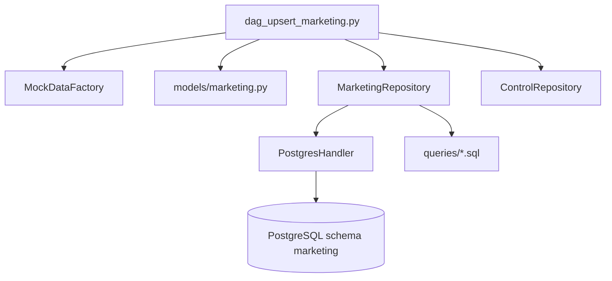

# Plano de Implementação: DAG de População de Marketing (P4)

## 1. Visão Geral e Arquitetura

O objetivo é implementar o pipeline do schema `marketing` (`dag_upsert_marketing.py`) no Apache Airflow, gerando termos de busca e benchmarks de performance com dados sintéticos realistas vinculados às especialidades da clínica.



---

## 2. Componentes e Decisões Técnicas

### 2.1 Integração com Especialidades de Clinic
O repositório `MarketingRepository` consultará as especialidades reais da base para manter consistência semântica:
```sql
SELECT specialty_id, name 
FROM clinic.specialties 
ORDER BY specialty_id ASC;
```

### 2.2 Migração de Banco de Dados (Suporte a Upsert)
Adição da migration `V20260507__add_marketing_unique_constraints.sql`:
```sql
CREATE UNIQUE INDEX IF NOT EXISTS uq_marketing_search_terms_spec_term 
ON marketing.marketing_search_terms (specialty_id, search_term);

CREATE UNIQUE INDEX IF NOT EXISTS uq_marketing_benchmarks_specialty 
ON marketing.marketing_benchmarks (specialty);
```

### 2.3 Queries de Upsert
1. `upsert_marketing_search_terms.sql`:
   ```sql
   INSERT INTO marketing.marketing_search_terms (specialty_id, search_term)
   VALUES (:specialty_id, :search_term)
   ON CONFLICT (specialty_id, search_term) DO NOTHING;
   ```
2. `upsert_marketing_benchmarks.sql`:
   ```sql
   INSERT INTO marketing.marketing_benchmarks (
       specialty, base_cpc, base_cvr, elasticity_score, net_margin_limit
   )
   VALUES (
       :specialty, :base_cpc, :base_cvr, :elasticity_score, :net_margin_limit
   )
   ON CONFLICT (specialty) DO UPDATE SET
       base_cpc = EXCLUDED.base_cpc,
       base_cvr = EXCLUDED.base_cvr,
       elasticity_score = EXCLUDED.elasticity_score,
       net_margin_limit = EXCLUDED.net_margin_limit;
   ```

---

## 3. Estrutura de Arquivos

| Arquivo | Ação | Responsabilidade |
| :--- | :--- | :--- |
| `database/render/migrations/V20260507__add_marketing_unique_constraints.sql` | Criar | Índices únicos para suportar `ON CONFLICT`. |
| `etl/airflow/dags/models/marketing.py` | Criar | DTOs `MarketingSearchTermModel` e `MarketingBenchmarkModel`. |
| `etl/airflow/dags/infraestructure/repository/marketing/queries/*.sql` | Criar | Queries de upsert e consulta em arquivos SQL isolados. |
| `etl/airflow/dags/infraestructure/repository/marketing/marketing_repo.py` | Criar | Repositório de persistência e consulta. |
| `etl/airflow/dags/infraestructure/repository/marketing/__init__.py` | Criar | Export do módulo do repositório. |
| `etl/airflow/dags/dag_upsert_marketing.py` | Criar | DAG Airflow `pipeline_upsert_marketing_data`. |
| `etl/airflow/dags/tests/test_marketing_pipeline.py` | Criar | Testes unitários para DTOs, repositório e DAG. |

---

## 4. Estratégia de Testes

1. **Validação de DTOs**: Teste de validação Pydantic de limites, tipos numéricos e serialização.
2. **Validação de Repositório**: Mock de `PostgresHandler` verificando queries SQL e passagem de named parameters `:param`.
3. **Validação de DAG Airflow**: Importação e instanciação sem erros de sintaxe ou ciclo de dependências.
