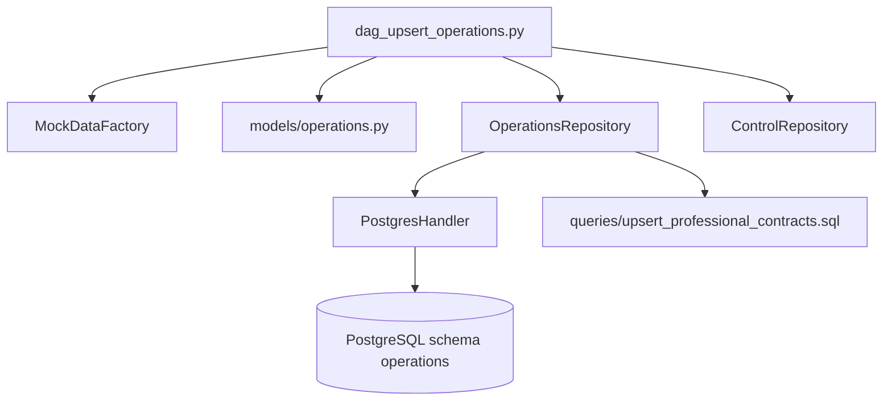

# Plano de Implementação: DAG de População de Operations (P3)

## 1. Visão Geral e Arquitetura

O objetivo é implementar o pipeline do schema `operations` (`dag_upsert_operations.py`) no Apache Airflow, gerando contratos operacionais (`operations.professional_contracts`) com dados sintéticos de alta fidelidade econômica e vínculo com os profissionais do schema `clinic`.



---

## 2. Componentes e Decisões Técnicas

### 2.1 Integração Relacional com Schema Clinic
Para garantir total consistência com os dados reais de `clinic`, o repositório `OperationsRepository` (ou `PostgresHandler`) fará a leitura dos profissionais e suas respectivas especialidades:
```sql
SELECT p.professional_id, s.name AS specialty
FROM clinic.professionals p
JOIN clinic.specialties s ON p.specialty_id = s.specialty_id
WHERE p.is_active = TRUE
ORDER BY p.professional_id ASC;
```

### 2.2 Modelagem de Dados e Cálculo de Break-Even
Cada contrato profissional contém:
- `professional_id`: ID do profissional.
- `specialty`: Nome da especialidade.
- `weekly_hours_contracted`: Horas semanais (20, 30, 40 horas).
- `weekly_fixed_cost`: Custo fixo semanal contratado (R$ 2.000 a R$ 6.000).
- `service_price`: Preço de tabela do serviço (R$ 150 a R$ 500).
- `variable_cost_per_service`: Custo variável unitário (R$ 20 a R$ 80).
- `be_threshold_units`: Volume mínimo de atendimentos semanais para cobrir o custo fixo:
  $$\text{be\_threshold\_units} = \max\left(1, \left\lceil \frac{\text{weekly\_fixed\_cost}}{\text{service\_price} - \text{variable\_cost\_per\_service}} \right\rceil\right)$$

### 2.3 Suporte a Upsert (Migração DDL)
- Adição da migration `V20260506__add_operations_unique_constraints.sql` com:
  ```sql
  CREATE UNIQUE INDEX IF NOT EXISTS uq_professional_contracts_prof_id 
  ON operations.professional_contracts (professional_id);
  ```
- Query `upsert_professional_contracts.sql` com `ON CONFLICT (professional_id) DO UPDATE SET ...` e named parameters `:param`.

---

## 3. Alterações Estruturais

| Arquivo | Ação | Responsabilidade |
| :--- | :--- | :--- |
| `database/render/migrations/V20260506__add_operations_unique_constraints.sql` | Criar | Adicionar índice único para suporte a `ON CONFLICT`. |
| `etl/airflow/dags/models/operations.py` | Criar | DTO `ProfessionalContractModel` com validações Pydantic. |
| `etl/airflow/dags/infraestructure/repository/operations/queries/upsert_professional_contracts.sql` | Criar | Query de upsert em SQL puro com parâmetros `:param`. |
| `etl/airflow/dags/infraestructure/repository/operations/operations_repo.py` | Criar | Repositório de persistência e leitura para o schema operations. |
| `etl/airflow/dags/infraestructure/repository/operations/__init__.py` | Criar | Export do repositório de operations. |
| `etl/airflow/dags/dag_upsert_operations.py` | Criar | DAG Airflow `pipeline_upsert_operations_data`. |
| `etl/airflow/dags/tests/test_operations_pipeline.py` | Criar | Testes unitários de DTO, repositório, break-even e DAG. |

---

## 4. Estratégia de Testes

1. **Validação de DTOs**:
   - Testar instanciação, constraints de valores positivos e serialização com `model_dump()`.
2. **Validação de Repositório**:
   - Validar execução de batch de upsert e consulta de profissionais de `clinic`.
3. **Validação de Break-Even**:
   - Garantir fórmula matemática com margem de contribuição estritamente positiva.
4. **Validação da DAG**:
   - Testar integridade da DAG, tags, tasks e importação no Airflow sem erros.

---

## 5. Riscos e Mitigações

* **Risco**: Ausência de profissionais em `clinic`.
  * **Mitigação**: O pipeline verifica se há profissionais cadastrados. Se não houver, finaliza com 0 contratos processados de forma graciosa.
* **Risco**: Margem negativa gerando break-even infinito ou negativo.
  * **Mitigação**: Validação garantindo que `service_price > variable_cost_per_service` com diferença mínima de R$ 50,00.
